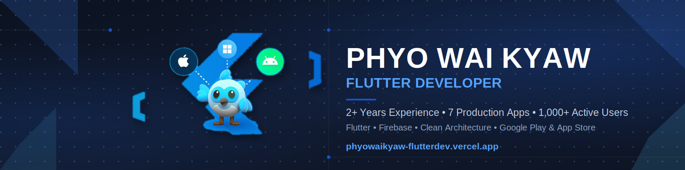
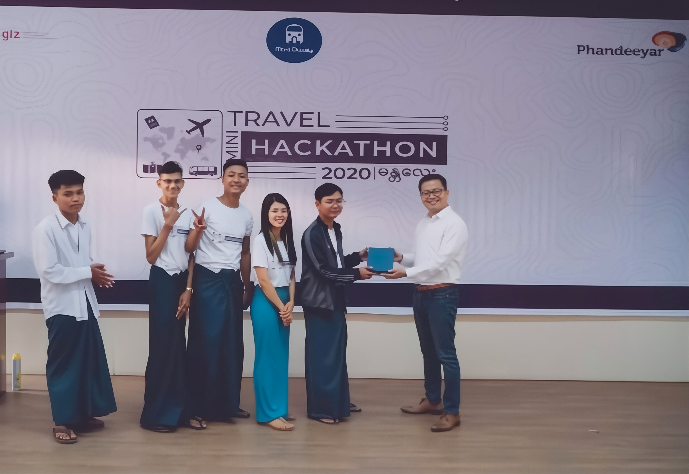
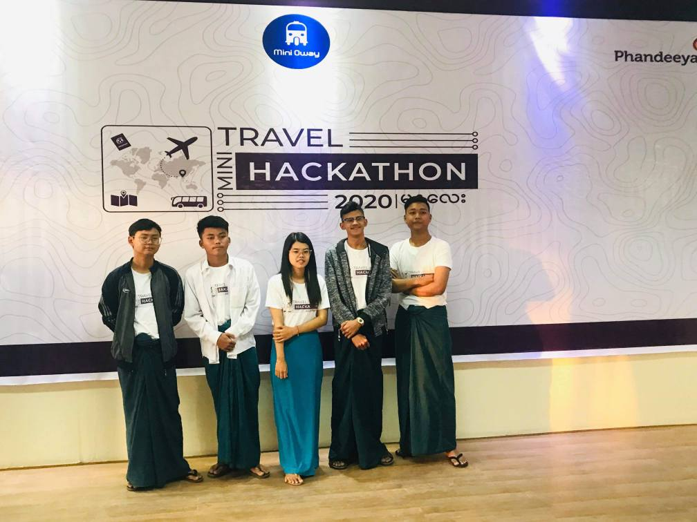

<div align="center">

# 👋 Hi, I'm Phyo Wai Kyaw
### 📱 Flutter Developer · Building Production-Ready Apps for Real Users
### 📍 Chonburi, Thailand · From Myanmar


<br/>

[](https://flutter-developer-portfolio-phi.vercel.app)
[](https://www.linkedin.com/in/phyowaikyaw-dev)
[](mailto:phyowalkyawdeveloper@gmail.com)
[](https://github.com/phyowaikyaw-mobiledev)

</div>

---

## 🚀 About Me

```dart
class PhyoWaiKyaw extends FlutterDeveloper {
  
  final String company     = "Root Studio Asia";
  final String location    = "Chonburi, Thailand 🇹🇭 · From Myanmar 🇲🇲";
  final String focus       = "Production-grade mobile & web apps";
  
  final List<String> currentWork = [
    "🏥 DrZon Healthcare App",
    "🛍️ Pan Customer App",
  ];

  final String achievement = "1st Runner Up · Oway Travel Hackathon 2020";
  final bool   openToWork  = true;

  final List<String> lookingFor = [
  "Remote Flutter roles",
  "International opportunities",
]
}
```

---

## 🛠️ Tech Stack

<div align="center">


</div>

<details>
<summary>📦 More Stack Details</summary>
<br/>

| Category | Technologies |
|----------|-------------|
| **Mobile** | Flutter, Dart, Material Design 3, Responsive UI |
| **State Management** | GetX, BLoC/Cubit, Provider |
| **Backend & API** | Firebase, REST API,Retrofit, Dio, JSON |
| **Database** | Firestore, Hive, SQLite, Realm DB |
| **Architecture** | Clean Architecture, MVC, Repository Pattern |
| **Tools** | Git, Postman, Android Studio, VS Code, Figma |

</details>

---

## 💼 Work Experience

### 🏢 Flutter Developer — Root Studio Asia
** Jan 2026 – Present** · Yangon, Myanmar (Remote)

> Building production mobile applications used by real users

- 🏥 Developing **DrZon Healthcare App** — notification system, REST API integration with Dio
- 🛍️ Developing **Pan Customer App** — cross-platform production application
- 🏗️ Implementing Clean Architecture with repository pattern & l10n localization
- 👥 Participating in code reviews & Agile workflow with senior developer
- 📱 Contributed UI components to **Phone King Plus** — published loyalty rewards app

---

## 🚀 Production Apps
 
<table>
  <tr>
    <td align="center" width="50%">
      <h3>📱 Phone King Plus — Customer</h3>
      <p>Loyalty rewards platform — earn points, track rewards & redeem exclusive offers</p>
      <p>
        <a href="https://play.google.com/store/apps/details?id=asia.rootstudio.phone_king_customer">
          
        </a>
        <a href="https://apps.apple.com/th/app/phoneking-plus/id6757488887">
          
        </a>
      </p>
      <p><code>Flutter</code> <code>REST API</code> <code>UI Contributor</code></p>
    </td>
    <td align="center" width="50%">
      <h3>⚙️ Phone King Plus — Admin</h3>
      <p>Admin panel for managing the loyalty platform — stores, rewards & users</p>
      <p>
        <a href="https://play.google.com/store/apps/details?id=asia.rootstudio.phone_king_admin">
          
        </a>
        <a href="https://apps.apple.com/th/app/phoneking-plus-admin/id6757606298">
          
        </a>
      </p>
      <p><code>Flutter</code> <code>REST API</code> <code>UI Contributor</code></p>
    </td>
  </tr>
  <tr>
    <td align="center" width="50%">
      <h3>🏥 DrZon Healthcare</h3>
      <p>Healthcare app connecting patients with medical services in Myanmar & Thailand</p>
      <p></p>
      <p><code>Flutter</code> <code>Dio</code> <code>Clean Architecture</code> <code>l10n</code></p>
    </td>
    <td align="center" width="50%">
      <h3>🛍️ Pan Customer App</h3>
      <p>Cross-platform production application @ Root Studio Asia</p>
      <p></p>
      <p><code>Flutter</code> <code>REST API</code> <code>Clean Architecture</code></p>
    </td>
  </tr>
  <tr>
    <td align="center" colspan="2">
      <h3>🌐 Learners Gateway</h3>
      <p>Live Flutter Web blog platform for tech education community</p>
      <p>
        <a href="https://learners-gateway.web.app">
          
        </a>
      </p>
      <p><code>Flutter Web</code> <code>Firebase</code> <code>Provider</code></p>
    </td>
  </tr>
</table>

---

## 🗂️ Personal Projects
 
#### 🛒 E-Commerce App
> Full-featured shopping platform with cart, Firebase Auth & real-time state management
 
`Flutter` `Firebase` `GetX` `Material Design 3` &nbsp;·&nbsp; [View Code →](https://github.com/phyowaikyaw-mobiledev/e_commerce)
 
---
 
#### 🎓 EduHub LMS
> Dual-role learning management system (Student & Teacher) with offline support
 
`Flutter` `BLoC/Cubit` `Hive` `Firebase` &nbsp;·&nbsp; [View Code →](https://github.com/phyowaikyaw-mobiledev/eduhub_lms)
 
---
 
#### 📓 Pardon Diary
> Google Keep-inspired note app with real-time updates & full-text search
 
`Flutter` `Realm DB` `Streams` `Material Design 3` &nbsp;·&nbsp; [View Code →](https://github.com/phyowaikyaw-mobiledev/pardon_diary-note)
 
---
 
#### 🎵 Ying Music
> Music streaming UI clone with hero animations & smooth playback controls
 
`Flutter` `Material Design 3` `Custom Animations` &nbsp;·&nbsp; [View Code →](https://github.com/phyowaikyaw-mobiledev/music_app)
 
---
 
#### 👥 SocialHub
> Facebook-inspired social media UI with news feed & notification system
 
`Flutter` `Custom Widgets` `Navigation` &nbsp;·&nbsp; [View Code →](https://github.com/phyowaikyaw-mobiledev/social_media_ui_clone)

---

## 🏆 Award

<div align="center">
🥈 **1st Runner Up — Oway Travel Hackathon 2020**
<br/>Organized by Phandeeyar Foundation · Mandalay
<br/>🏅 $1,000 AWS Cloud Credits · 20+ competing teams

<br/>
<br/>
<table>
  <tr>
    <td align="center">
      
      <br/>
      <sub>🏅 Award Ceremony</sub>
    </td>
    <td align="center">
      
      <br/>
      <sub>👥 Team Heaven</sub>
    </td>
  </tr>
</table>

</div>
 
---
 
## 🎓 Education & Certifications
 
### 🏫 Education
 
| Degree | Institution | Year |
|--------|------------|------|
| 🎓 Computer Science Major | Computer University, Mandalay | 2018 – 2021 |

> ⚠️ *Did not complete due to COVID-19 and the political situation in Myanmar.*

 
### 📜 Certifications — KMD Education Center
 
| Certificate | Link |
|-------------|------|
| 💻 Software Engineering - VB.Net | [View Certificate](https://drive.google.com/file/d/1RmtfiISi_GkkF6IfQLR9VYcB40HDQpOL/view?usp=drive_link) |
| 🔧 Practical A+ Hardware & Networking | [View Certificate](https://drive.google.com/file/d/1wSZBLoJyD8scwHa2jsEygWDWr7w0gik8/view?usp=drive_link) |
| 🌐 Computer Basic | [View Certificate](https://drive.google.com/file/d/1wSZBLoJyD8scwHa2jsEygWDWr7w0gik8/view?usp=drive_link) |
| 🧠 Problem Solving with Programming Concepts | [View Certificate](https://drive.google.com/file/d/1iPL-KTxHDLv7M53SiojzL6ZI1lC6YV_5/view?usp=drive_link) |
| 📊 Microsoft PowerPoint (Advanced) | [View Certificate](https://drive.google.com/file/d/1uwMXSp6dSvQQam0VxmipEolAoGUR1mLa/view?usp=drive_link) |

### 📜 Certification - University Of Computer (Mandalay)

| Certificate | Link |
|-------------|------|
| 🌍 Web Development Foundation (Html,Css,Bootstrap,JavaScript) | [View Certificate](https://drive.google.com/file/d/1FQP0YdhVloXF-LOdfdG3KFmZNqGTbCyH/view?usp=drive_link) |

## 🌐 Community

### ✍️ Learners Gateway Initiative · 2024 – Present
Building Software development community — creating technical content, sharing real-world experience.

[](https://learners-gateway.web.app)

---

<div align="center">

### 📬 Let's Connect

**📧** phyowalkyawdeveloper@gmail.com &nbsp;|&nbsp; **📱** +66-626-509163

<br/>
*"Building meaningful mobile experiences with clean code and purpose."*

**⚡ Usually responds within 24 hours · Open to Flutter Developer roles & remote work!**
<br/>
 
---
 
✨ **Personal Motto**

*"Crafting meaningful mobile experiences with precision, speed, and purpose."*

<br/>

Thanks for visiting! Feel free to reach out if you want to collaborate or build something impactful together. 🚀
</div>
